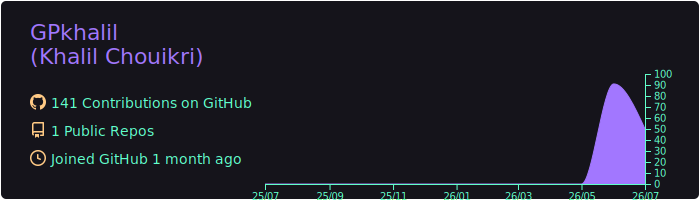
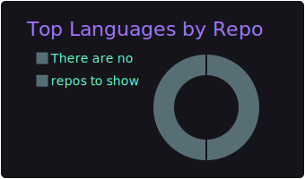
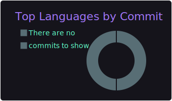
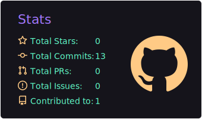
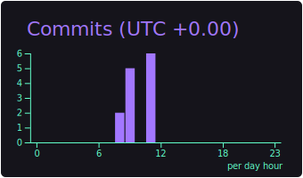

<!--
  GreenPraxis profile README — Khalil Chouikri
  TODO before committing:
   1. Upload a banner.jpg to the GPkhalil/GPkhalil repo (or remove the banner line).
   2. The profile-summary-card-output/* images only appear AFTER you set up the
      profile-summary-cards GitHub Action — and the action's USERNAME must be set
      to GPkhalil (see the workflow note shared alongside this file).
-->

<h1 align="center">Hi, I'm KHALIL CHOUIKRI</h1>

<h3 align="center">Environmental AI • Geospatial Data Science • Machine / Deep Learning • Backend Development</h3>

---

## About Me

Hello! I'm **Khalil Chouikri**, a data scientist at **Green PRAXIS**, where we industrialize biodiversity and natural-asset assessment by combining **machine learning, geospatial data, and physics-based modeling**.

My work focuses on turning complex ecological and environmental data into **scalable, auditable, data-driven decisions** — habitat mapping, species-presence probability, biodiversity and carbon indicators, and risk modeling for land and infrastructure. I bring a background in **hybrid semi-parametric models** and **physics + AI**, and I now apply it to nature-based solutions and sustainable land management.

### What I Do

I specialize in:

- Geospatial ML/DL for environmental diagnostics & habitat mapping
- Biodiversity, carbon, and ecological-risk modeling at portfolio scale
- Hybrid physics-guided learning & semi-parametric models
- Remote sensing, GIS pipelines & raster/vector data processing
- Scientific computing, model evaluation & reproducible, auditable analytics
- Backend services & APIs to deploy models into production

### Let's Connect

Always open to collaborations in **environmental science, geospatial ML/DL, physics**, and applied data science.

**Email:** [khalil@greenpraxis.com](mailto:khalil@greenpraxis.com)
**Portfolio:** [khalil-chouikri.self.so](https://www.self.so/khalil-chouikri-y38xd5)
**LinkedIn:** [khalil-chouikri](https://linkedin.com/in/khalil-chouikri-a0065a1a6/)

---

## Tech Stack

### AI / Machine Learning

### Geospatial & Remote Sensing

### Development & Frameworks

### DevOps & Tools

### Databases

### Other Tools

---

## GitHub Statistics

  

  
  

  
  

  

---

## Connect With Me

  
  
  

---

<!-- 

  

 -->

---
